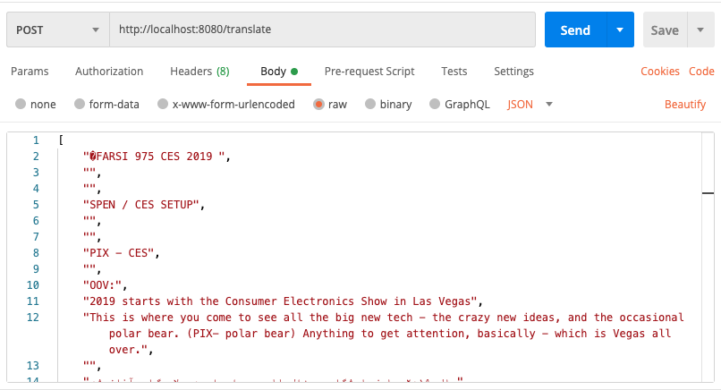

# translate-data

An API that takes an input of translated scripts (array of strings) and outputs formatted JSON data.

The API detects and separates out the data into:

* Metadata
* English
* Persian

**For example**, this input data:

```json
["This is very futuristic.""DAVE:", " این خیلی آینده‌نگرانه است..", "Yes", "MARCIE MILLER:", "بله "]
```

Would output:

```
{
    "script": [
        {
            "english": "This is very futuristic.",
            "meta": "DAVE",
            "farsi": " این خیلی آینده‌نگرانه است.."
        },
        {
            "english": "Yes",
            "meta": "MARCIE MILLER",
            "farsi": " بله "
        }
    ]
}
```


## Setup

Clone this repo by running:

```bash
git clone git@github.com:sarahrainbow/translate-data.git
cd translate-data
```


Install dependencies by running:

```
npm install
```


### Make a Request

```
POST /translate
```

Request body: array of strings e.g.

`["This is very futuristic.""DAVE:", " این خیلی آینده‌نگرانه است.."]`


## Local Development

To install the dependencies run

`npm i`

To run development environment on localhost:8080

`npm start`

Using an API emulator tool (e.g. Postman) make a POST request with the input json data in the Body field with the route `http://localhost:8080/translate`




On `SEND` this should yield the converted output in the same format as the following example:

```json
{
    "script": [
        {
            "english": "This is very futuristic.",
            "meta": "DAVE",
            "farsi": " این خیلی آینده‌نگرانه است.."
        },
        {
            "english": "Yes",
            "meta": "MARCIE MILLER",
            "farsi": " بله "
        }
    ]
}
```

## Testing

To run the tests:
```
npm run test
```

## Want more?
See documentation [here](docs/documentation).

